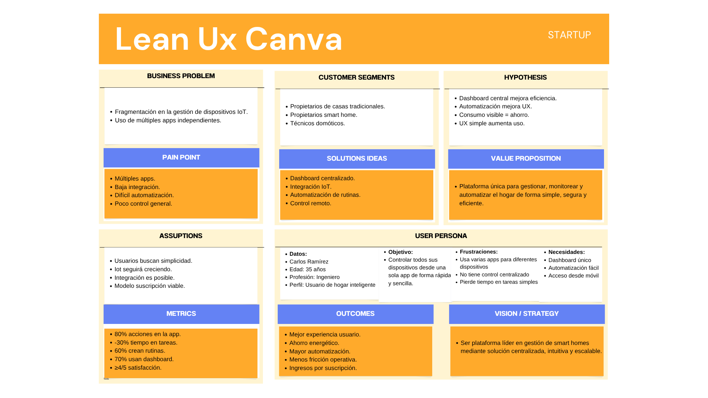
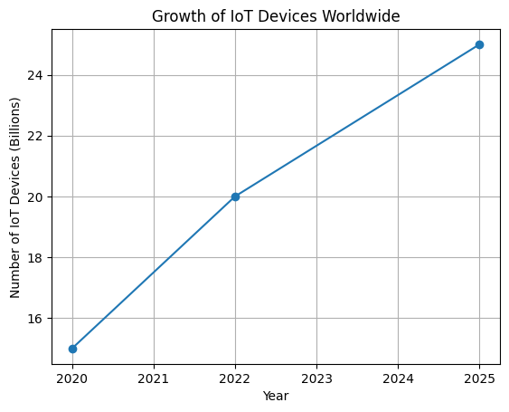



# **Universidad Peruana de Ciencias Aplicadas**

### **Informe de Trabajo Final**

**Carrera**: Ingeniería de Software

**Curso**: Aplicaciones Web

**Sección**: 

**Profesor**: 

**Ciclo**: 2026-1

**Startup:** Dev-il-team

**Nombre del Producto**: Hero

**Integrantes**:

Alfaro Coveñas, Louis Piero (u20191b299)
 

**Abril del 2026**

**Contenido**

[Contenido	4](#_heading=h.nsca8d7rezbs)

[Registro de Versiones del Informe	4](#_heading=h.8gxu27autull)

[Project Report Collaboration Insights	4](#_heading=h.iqfc12at5bpt)

[Contenido	4](#_heading=h.wkpb2ihpzcry)

[Student Outcome	4](#_heading=h.nbg6pah72qg3)

[1.](#_heading=h.iv3t72wpl8ge)Capítulo I: Introducción	4

[1.1](#_heading=h.cef4nj5tp5jz)Startup Profile	4

[1.1.1](#_heading=h.u8z3eha1kjlr)Descripción de la Startup	4

[1.1.2](#_heading=h.so7ggpcn42dv)Perfiles de integrantes del equipo	4

[1.2](#_heading=h.1m24yvgbflqv)Solution Profile	4

[1.2.1](#_heading=h.6jokok7g5pjs)Antecedentes y problemática	4

[1.2.2](#_heading=h.aq79i3msu58b)Lean UX Process	4

[1.3](#_heading=h.u9rq93k9sjtu)Segmentos objetivo	4

[2.](#_heading=h.mpt88vqezrd5)Capítulo II: Requirements Elicitation & Analysis	4

[2.1](#_heading=h.ljhxf313n4wx)Competidores	4

[2.1.1](#_heading=h.ujj48hrqdi0c)Análisis competitivo	4

[2.1.2](#_heading=h.my5j2aczngvl)Estrategias y tácticas frente a competidores	4

[2.2](#_heading=h.kvwvqspqui7h)Entrevistas	5

[2.2.1](#_heading=h.7ese9n6lynt)Diseño de entrevistas	5

[2.2.2](#_heading=h.okh2o93lng7c)Registro de entrevistas	5

[2.2.3](#_heading=h.o04xobkxbyxf)Análisis de entrevistas	5

[2.3](#_heading=h.5a8vg9lw2y2c)Needfinding	5

[2.3.1](#_heading=h.t3o44d82qj3a)User Personas	5

[2.3.2](#_heading=h.lijtivpgh7c5)User Task Matrix	5

[2.3.3](#_heading=h.ll58dvw5y4kr)User Journey Mapping	5

[2.3.4](#_heading=h.g6ujnqjos6ot)Empathy Mapping	5

[2.4](#_heading=h.ne223vmjcl1k)Big Picture Event Storming	5

[2.5](#_heading=h.8x2fe8afchzg)Ubiquitous Language	5

[3.](#_heading=h.z0puptyhajil)Capítulo III: Requirements Specification	5

[3.1](#_heading=h.ninegv5ehvr6)User Stories	5

[3.2](#_heading=h.60m5bn8l7hr1)Impact Mapping	5

[3.3](#_heading=h.zg59gto95pem)Product Backlog	5

[4.](#_heading=h.ftlgdwye8mrx)Capítulo IV: Product Design	5

[4.1](#_heading=h.i1rqnvvb3607)Style Guidelines	5

[4.1.1](#_heading=h.ibxm6lyctd1o)General Style Guidelines	5

[4.1.2](#_heading=h.apxm94j2hm3i)Web Style Guidelines	5

[4.2](#_heading=h.1wnlsnvmal0)Information Architecture	5

[4.2.1](#_heading=h.qdb0mttcqmkw)Organization Systems	5

[4.2.2](#_heading=h.yzxfenmkk40k)Labeling Systems	5

[4.2.3](#_heading=h.l9q26x80sjql)SEO Tags and Meta Tags	5

[4.2.4](#_heading=h.mv3rtgxu1jz1)Searching Systems	6

[4.2.5](#_heading=h.2hipzstl6721)Navigation Systems	6

[4.3](#_heading=h.rojhptn4iwi)Landing Page UI Design	6

[4.3.1](#_heading=h.1d6yrvhnxfvs)Landing Page Wireframe	6

[4.3.2](#_heading=h.8ynxe0wd3cc4)Landing Page Mock-up	6

[4.4](#_heading=h.jo7z03iywcxs)Web Applications UX/UI Design	6

[4.4.1](#_heading=h.xcw6j978w1x1)Web Applications Wireframes	6

[4.4.2](#_heading=h.l9fkgpdvlhvm)Web Applications Wireflow Diagrams	6

[4.4.3](#_heading=h.wo40dt7nxvm)Web Applications Mock-ups	6

[4.4.4](#_heading=h.mye49oa1d0ib)Web Applications User Flow Diagrams	6

[4.5](#_heading=h.dqkl1v9s4wrd)Web Applications Prototyping	6

[4.6](#_heading=h.dsoyukexk86z)Domain-Driven Software Architecture	6

[4.6.1](#_heading=h.7bmjrhaitftm)Design-Level Event Storming	6

[4.6.2](#_heading=h.9qsvjr9uw0uy)Software Architecture Context Diagram	6

[4.6.3](#_heading=h.bhhi3v3lg76c)Software Architecture Container Diagrams	6

[4.6.4](#_heading=h.6mhar39s7ieo)Software Architecture Component Diagrams	6

[4.7](#_heading=h.2c7tnoucte9q)Software Object-Oriented Design	6

[4.7.1](#_heading=h.nbmdm9mz8i1x)Class Diagrams	6

[4.8](#_heading=h.gt5ce9a9u843)Database Design	6

[4.8.1](#_heading=h.id6qkfacivqe)Database Diagrams	6

[5.](#_heading=h.vs16l3cu2sa)Capítulo V: Product Implementation, Validation & Deployment	6

[5.1](#_heading=h.rl921vfr5x5t)Software Configuration Management	6

[5.1.1](#_heading=h.wciwa96dqhjz)Software Development Environment Configuration	6

[5.1.2](#_heading=h.sxm29qydtv5w)Source Code Management	6

[5.1.3](#_heading=h.entremi3v14m)Source Code Style Guide & Conventions	7

[5.1.4](#_heading=h.ogohwao3lwy5)Software Deployment Configuration	7

[5.2](#_heading=h.gahcrecuaroi)Landing Page, Services & Applications Implementation	7

[5.3](#_heading=h.gxn384yt4l0b)Validation Interviews	7

[5.3.1](#_heading=h.7n3fxroubvca)Diseño de Entrevistas	7

[5.3.2](#_heading=h.2v2sia1c5evx)Registro de Entrevistas	7

[5.3.3](#_heading=h.vuhfy3ig0nel)Evaluaciones según heurísticas	7

[5.4](#_heading=h.uggbvvx0cssu)Video About-the-Product	7

[Conclusiones	7](#_heading=h.43pqdzlh8r5j)

[Bibliografía	7](#_heading=h.rf3ije8prsh)

[Anexos	7](#_heading=h.gmdtiwg9ege6)

# **Contenido**
# **Registro de Versiones del Informe**
# **Project Report Collaboration Insights**
# **Contenido**
# **Student Outcome**
1. # **Capítulo I: Introducción**
   1. ## **Startup Profile**
 
   La startup propuesta se enfoca en el desarrollo de soluciones tecnológicas orientadas a la automatización y gestión de hogares inteligentes mediante el uso de tecnologías IoT (Internet of Things). Su principal objetivo es ofrecer una plataforma web centralizada que permita a los usuarios controlar, monitorear y optimizar los dispositivos inteligentes de su vivienda de manera sencilla, segura y eficiente.
La empresa busca posicionarse en el sector de la domótica, ofreciendo un software innovador que integre múltiples dispositivos en un solo sistema, eliminando la necesidad de utilizar diversas aplicaciones independientes para cada dispositivo.

      1. ### **Descripción de la Startup**
      
      La startup, denominada tentativamente Smart Home HERA, es una empresa tecnológica dedicada al desarrollo de una aplicación web que permite la gestión integral de hogares inteligentes.
La solución propuesta consiste en una plataforma digital accesible desde cualquier dispositivo con conexión a internet, mediante la cual los usuarios pueden interactuar con distintos dispositivos IoT instalados en su hogar, tales como sistemas de iluminación, sensores de movimiento, cámaras de seguridad, cerraduras electrónicas, sistemas de climatización, sistemas de monitoreo de piscina y electrodomésticos inteligentes.
El software ofrece funcionalidades clave como:
panel central de control (dashboard)
gestión y organización de dispositivos
control remoto de funciones
automatización mediante rutinas programadas
monitoreo en tiempo real del estado del hogar
análisis del consumo energético
La propuesta de la startup se basa en brindar una experiencia de usuario intuitiva y accesible, permitiendo simplificar la interacción con la tecnología doméstica y mejorar la calidad de vida de los usuarios.
Además, el modelo de negocio contempla la oferta de servicios bajo suscripción, incluyendo un plan básico y un plan premium que incorpora funcionalidades avanzadas como automatizaciones inteligentes, alertas personalizadas, mantenimiento preventivo y reportes detallados de consumo.
De esta manera, la startup busca no solo facilitar la gestión del hogar inteligente, sino también promover la eficiencia energética, la seguridad y la comodidad en la vida cotidiana de sus clientes.

      1. ### **Perfiles de integrantes del equipo**
   El equipo está conformado por estudiantes de Ingeniería de Software con habilidades complementarias en desarrollo, diseño y gestión de proyectos, lo que permite abordar de manera integral la creación de la solución tecnológica propuesta.
   
Integrante 1:
Nombre: Piero Leonardo Molina Falcón

  

Código de estudiante: U201610857

Carrera: Ingeniería de software 

Descripción: Estudiante de Ingeniería de Software con formación en desarrollo de aplicaciones web, UI/UX, base de datos, conocimientos en programación, estructuras de datos y diseño de sistemas/software. Cuenta con comprensión de arquitecturas de software, desarrollo en el área backend y frontend. Destaca por la capacidad de análisis, pensamiento lógico y disposición para el aprendizaje continuo en entornos tecnológicos.

Aporte al equipo: Ha participado en la definición del proyecto, la elaboración del Capítulo I del informe y la estructuración del Lean UX Process. Además, ha contribuido en la organización del equipo y en la distribución de tareas como team leader, asegurando el avance del proyecto de manera coordinada.

Integrante 2:
Nombre: Sebastián Gutarra Velapatiño

  

Código de estudiante: U20241A314

Carrera: Ingeniería de software

Descripción: Me llamo Sebastián, soy un estudiante de 6to ciclo de la carrera de ingeniería de software en la UPC, me caracterizo por la perseverancia, la responsabilidad, la empatía y trabajo en equipo. Me comprometo a terminar satisfactoriamente el presente trabajo junto a todo mi equipo para poder obtener el conocimiento necesario en desarrollar páginas web. 

Aporte al equipo: Participé en el capítulo 2, elaborando el cuadro de competidores, las user personas, el user task matrix, entre otros y en el capítulo 4 diseñando los wireframes y mockups en Figma.

Integrante 3:
Nombre: Luis German Tello Quispe

  

Código de estudiante: U202317767

Carrera: Ingeniería de Software

Descripción:Orientado al análisis funcional, encargado de la definición de requerimientos y documentación. Actualmente cursando el ciclo 5 de la carrera, con conocimientos en diseño de bases de datos, diseño UI y conocimientos en programacion.

Aporte al equipo:  Participe en la búsqueda y elaboración de user stories para nuestro proyecto, asi mismo para el desarrollo del impact mapping y product backlog. Además, realice los diagramas en modelo c4 para el proyecto.

Integrante 4: Louis Piero Alfaro Coveñas

  

Código de estudiante:u20191b299

Carrera: Ingeniería de Software

Descripción:Estudiante de Ingeniería de Software con interés en el desarrollo backend y arquitectura de sistemas. Cuenta con experiencia en programación en Java (versiones 8 y 17), uso de Spring Boot, desarrollo de APIs RESTful y manejo de bases de datos con JPA/Hibernate. Posee conocimientos en estructuras de datos, principios SOLID y patrones de diseño como MVC y Repository. Se encuentra en constante aprendizaje dentro del entorno tecnológico, con enfoque en mejorar sus habilidades como desarrollador.

Aporte al equipo:
Ha contribuido en el desarrollo backend del proyecto, participando en la implementación de servicios, estructuración de lógica de negocio y organización del código siguiendo buenas prácticas. Además, ha apoyado en la planificación técnica y en la distribución de tareas, asegurando el avance continuo del proyecto de manera ordenada y eficiente.

   1. ## **Solution Profile**
      1. ### **Antecedentes y problemática**
         
   En los últimos años, el crecimiento del Internet de las Cosas (IoT) ha impulsado la adopción de dispositivos inteligentes en los hogares, tales como luces automatizadas, cámaras de seguridad, sensores de movimiento, sistemas de climatización y electrodomésticos conectados. Sin embargo, este avance tecnológico ha traído consigo una problemática importante: la fragmentación en la gestión de dispositivos.
Muchos usuarios deben utilizar múltiples aplicaciones para controlar distintos dispositivos, lo que genera una experiencia poco eficiente, confusa y limitada. Además, existe una falta de herramientas accesibles que permitan integrar, automatizar y monitorear todos los dispositivos desde una sola plataforma.
Para comprender mejor esta problemática, se aplica la metodología 5W2H, la cual permite analizar el problema de forma estructurada:

     What (¿Qué está ocurriendo?)
Los usuarios de hogares inteligentes enfrentan dificultades para gestionar sus dispositivos debido a la existencia de múltiples plataformas y aplicaciones independientes. Esto limita la eficiencia, la comodidad y el control integral del hogar.

     Why (¿Por qué ocurre?)
Porque cada fabricante de dispositivos IoT desarrolla su propia aplicación, lo que impide una integración unificada. Además, muchas soluciones existentes son complejas, poco intuitivas o requieren conocimientos técnicos avanzados.

Where (¿Dónde ocurre?)
Este problema se presenta en hogares que cuentan con dispositivos inteligentes, especialmente en aquellos donde se han adquirido productos de diferentes marcas o proveedores tecnológicos.

     When (¿Cuándo ocurre?)
Ocurre de manera constante durante el uso cotidiano de los dispositivos, especialmente cuando el usuario necesita controlar múltiples elementos del hogar o realizar tareas repetitivas sin automatización.

     Who (¿Quiénes se ven afectados?)
Propietarios de viviendas inteligentes
Personas que desean convertir su hogar en smart home
Técnicos o empresas de instalación domótica
Usuarios con conocimientos tecnológicos básicos que buscan soluciones simples

     How (¿Cómo ocurre?)
La problemática se manifiesta a través de:
uso de múltiples aplicaciones para diferentes dispositivos
dificultad para monitorear el estado general del hogar
falta de automatización centralizada
procesos manuales repetitivos
poca visibilidad del consumo energético 

     How much (¿Qué impacto tiene?)
El impacto incluye:
pérdida de tiempo en la gestión de dispositivos
reducción en la eficiencia del hogar
menor aprovechamiento de la tecnología IoT
aumento del consumo energético por falta de control
frustración del usuario debido a la complejidad del sistema

     Conclusión del análisis
A partir del análisis, se identifica la necesidad de una solución que permita centralizar, simplificar y optimizar la gestión de dispositivos inteligentes en el hogar. En este contexto, la propuesta de una aplicación web como Smart Home HERA surge como una alternativa que busca integrar todos los dispositivos en una única plataforma, mejorando la experiencia del usuario y promoviendo la eficiencia, seguridad y comodidad.

En base a la problemática identificada, se definen los siguientes objetivos de la solución:

     Objetivos de la solución
Desarrollar una aplicación web que centralice la gestión de dispositivos IoT
Facilitar el control y monitoreo del hogar inteligente
Permitir la automatización de tareas domésticas
Mejorar la experiencia de usuario mediante una interfaz intuitiva

     Restricciones del proyecto
Dependencia de la compatibilidad con dispositivos IoT existentes
Limitaciones de integración con APIs de terceros
Necesidad de conexión a internet para el funcionamiento del sistema
Alcance limitado a una aplicación web (no app móvil nativa)
Tiempo y recursos del equipo de desarrollo

      1. ### **Lean UX Process**
         1. #### ***Lean UX Problem Statements***
         
   Dentro del enfoque Lean UX, los Problem Statements permiten definir de manera clara y centrada en el usuario los principales problemas que la solución busca resolver. Estos enunciados ayudan a enfocar el diseño del producto en necesidades reales, evitando suposiciones y guiando el desarrollo hacia una experiencia de usuario efectiva.
Para contextualizar los problemas identificados, se definen los siguientes elementos:

Domain: Gestión de hogares inteligentes (IoT).
Customer Segments: Propietarios, nuevos usuarios, técnicos.
Pain Points: Fragmentación, falta de integración, complejidad.
Gap: No existe una plataforma unificada simple.
Visión: Centralizar y simplificar la gestión del hogar

A partir de este contexto, se han identificado los siguientes Lean UX Problem Statements:

Problem Statement 1
Los propietarios de hogares inteligentes necesitan una forma sencilla y centralizada de gestionar todos sus dispositivos, ya que actualmente deben utilizar múltiples aplicaciones, lo que genera confusión, pérdida de tiempo y una experiencia poco eficiente.

Problem Statement 2
Los usuarios requieren visualizar el estado general de su hogar en tiempo real, debido a que no cuentan con una plataforma que les permita monitorear de forma integrada aspectos como iluminación, seguridad, temperatura y consumo energético.

Problem Statement 3
Las personas que desean automatizar su hogar necesitan herramientas intuitivas para programar rutinas, ya que las soluciones actuales suelen ser complejas o requieren conocimientos técnicos avanzados

Problem Statement 4
Los usuarios necesitan optimizar el consumo energético de sus hogares, pero no disponen de información clara ni de herramientas que les permitan analizar y controlar el uso de energía de sus dispositivos.

Problem Statement 5
Los técnicos y empresas de instalación domótica requieren una plataforma que facilite la gestión y monitoreo de múltiples hogares, ya que actualmente no cuentan con una solución unificada para brindar soporte eficiente a sus clientes.

Estos Problem Statements reflejan las principales dificultades que enfrentan los usuarios en la gestión de hogares inteligentes. A partir de ellos, se orienta el diseño de la solución propuesta, enfocándose en la centralización, simplicidad de uso, automatización y eficiencia, elementos clave para mejorar la experiencia del usuario dentro del ecosistema IoT.

         1. #### ***Lean UX Assumptions***
   En el enfoque Lean UX, las assumptions (suposiciones) representan hipótesis iniciales sobre los usuarios, sus necesidades, comportamientos y el valor que ofrece la solución. Estas suposiciones deben ser posteriormente validadas mediante pruebas con usuarios o prototipos.
   
A continuación, se presentan las principales suposiciones identificadas para el desarrollo de la solución propuesta:

1. Suposiciones sobre los usuarios
Los usuarios desean simplificar la gestión de sus dispositivos inteligentes mediante una única plataforma centralizada.
Los usuarios valoran una interfaz intuitiva y fácil de usar, sin necesidad de conocimientos técnicos avanzados.
Los usuarios utilizan con frecuencia dispositivos móviles, por lo que esperan que la solución sea completamente responsive.
Los usuarios están interesados en mejorar la comodidad, seguridad y control de su hogar.

2. Suposiciones sobre el problema
El uso de múltiples aplicaciones para gestionar dispositivos genera confusión y baja eficiencia.
La falta de integración entre dispositivos de distintas marcas es una de las principales barreras en la adopción de smart homes.
Los usuarios no cuentan con herramientas claras para monitorear el consumo energético.
La automatización del hogar es percibida como compleja o difícil de configurar.

3. Suposiciones sobre la solución
Una aplicación web centralizada mejorará significativamente la experiencia del usuario.
Un dashboard visual permitirá una mejor comprensión del estado del hogar.
La incorporación de automatizaciones facilitará la vida diaria de los usuarios.
La visualización de datos de consumo energético incentivará hábitos más eficientes.

4. Suposiciones sobre el valor del producto
Los usuarios estarán dispuestos a utilizar la plataforma si esta les ahorra tiempo y esfuerzo.
Existe interés en funcionalidades avanzadas mediante un modelo de suscripción premium.
La centralización de dispositivos será percibida como un valor diferencial frente a otras soluciones.

5. Suposiciones sobre el negocio
El mercado de hogares inteligentes continuará en crecimiento, aumentando la demanda de soluciones de gestión.
Se pueden establecer alianzas con técnicos o empresas domóticas para ampliar el alcance del producto.

El modelo de suscripción es viable y sostenible a largo plazo.
Estas suposiciones guían el desarrollo inicial del producto y sirven como base para la toma de decisiones en el diseño de la solución. Sin embargo, deberán ser validadas mediante pruebas con usuarios reales, prototipos y retroalimentación continua, siguiendo los principios del enfoque Lean UX.

         1. #### ***Lean UX Hypothesis Statements***
Hipótesis 1: Dashboard centralizado
Creemos que:
 Construir un dashboard centralizado que integre dispositivos de diferentes marcas en una sola plataforma
Para:
 Propietarios de hogares inteligentes que utilizan múltiples aplicaciones para gestionar sus dispositivos
Lograremos:
 Simplificar la gestión del hogar y reducir la fricción operativa
Sabremos que hemos tenido éxito cuando veamos:
Que el 80% de las acciones se realizan sin salir de la aplicación
Una reducción del 30% en el tiempo de ejecución de tareas comunes (encender luces, ajustar temperatura, etc.)

Hipótesis 2: Visualización del estado del hogar
Creemos que:
 Diseñar un panel visual que muestre el estado general del hogar en tiempo real
Para:
 Usuarios que necesitan supervisar múltiples dispositivos sin una vista unificada
Lograremos:
 Mejorar la comprensión del estado del hogar y la toma de decisiones rápida
Sabremos que hemos tenido éxito cuando veamos:
Que el 85% de los usuarios consulta el dashboard en cada sesión
Que el tiempo promedio para entender el estado del hogar es menor a 10 segundos

Hipótesis 3: Automatización de rutinas
Creemos que:
 Implementar un sistema sencillo de creación de rutinas automatizadas
Para:
 Usuarios que desean automatizar tareas pero encuentran complejas las soluciones actuales
Lograremos:
 Facilitar la automatización del hogar y mejorar la comodidad del usuario
Sabremos que hemos tenido éxito cuando veamos:
Que al menos el 60% de los usuarios crea una rutina durante la primera semana
Que el tiempo promedio de configuración es menor a 2 minutos

Hipótesis 4: Monitoreo de consumo energético
Creemos que:
 Incorporar un módulo de visualización y análisis del consumo energético
Para:
 Usuarios interesados en optimizar el uso de energía en su hogar
Lograremos:
 Fomentar un uso más eficiente de los recursos energéticos
Sabremos que hemos tenido éxito cuando veamos:
Que el 70% de los usuarios consulte el módulo semanalmente 
Que el 60% identifique oportunidades de ahorro 

Hipótesis 5: Experiencia de usuario intuitiva
Creemos que:
 Diseñar una interfaz simple, intuitiva y responsive
Para:
 Usuarios con conocimientos técnicos básicos
Lograremos:
 Reducir la curva de aprendizaje y mejorar la usabilidad del sistema
Sabremos que hemos tenido éxito cuando veamos:
Una puntuación mínima de 4/5 en pruebas de usabilidad
Que el 90% de los usuarios completa tareas básicas sin asistencia

Hipótesis 6: Funcionalidades premium
Creemos que:
 Ofrecer funcionalidades avanzadas mediante un plan premium (automatizaciones avanzadas, reportes, alertas)
Para:
 Usuarios avanzados y empresas de domótica
Lograremos:
 Incrementar el valor percibido del producto y generar ingresos sostenibles
Sabremos que hemos tenido éxito cuando veamos:
Que el 20% de los usuarios muestra interés en el plan premium
Que al menos el 10% estaría dispuesto a pagar por estas funcionalidades 

Las hipótesis formuladas permiten validar de manera estructurada si las decisiones de diseño propuestas generan valor real en los usuarios. A través de métricas claras, se podrá evaluar el impacto del sistema y ajustar el producto en función de resultados medibles, siguiendo los principios del enfoque Lean UX.

         1. #### ***Lean UX Canvas***
   El Lean UX Canvas resume la visión del producto, los problemas identificados, los segmentos de usuarios, las suposiciones y las hipótesis definidas previamente. Este modelo permite alinear el desarrollo del software con las necesidades reales del usuario y los objetivos del negocio.
   
A continuación, se presenta el Lean UX Canvas del proyecto:

  

[A continuación, se adjunta el enlace del canva](https://canva.link/8pfv4avhjqinc36)

   1. ## **Segmentos objetivo**
      
La solución propuesta está dirigida a tres segmentos principales de usuarios, definidos en función de sus necesidades, nivel de adopción tecnológica y relación con los sistemas de hogares inteligentes.
1.3.1 Propietarios de viviendas que desean convertir su hogar en smart home
Este segmento está conformado por personas que poseen viviendas tradicionales y buscan modernizar su hogares mediante la incorporación de dispositivos inteligentes.

Características demográficas:
Edad: 25 – 45 años
Nivel socioeconómico: medio – medio alto
Ubicación: zonas urbanas
Nivel tecnológico: básico a intermedio
Estos usuarios suelen estar motivados por mejorar la comodidad, seguridad y eficiencia de su hogar, pero enfrentan barreras como la falta de conocimiento técnico o la complejidad de las soluciones disponibles.
1.3.2 Propietarios de hogares inteligentes
Este segmento incluye a usuarios que ya cuentan con dispositivos IoT instalados en su vivienda, como luces inteligentes, cámaras de seguridad, sensores o sistemas de climatización.
Características demográficas:
Edad: 30 – 50 años
Nivel socioeconómico: medio alto – alto
Nivel tecnológico: intermedio – avanzado
Según tendencias del mercado, el uso de dispositivos IoT en el hogar ha crecido significativamente en los últimos años, lo que ha incrementado la necesidad de soluciones que integren estos sistemas.
Según estudios de mercado, el número de dispositivos IoT en el hogar ha crecido de forma sostenida en los últimos años. De acuerdo con Statista, se estima que el número de dispositivos conectados a nivel mundial superará los 25 mil millones, impulsando la adopción de tecnologías de hogar inteligente.
Asimismo, reportes de Gartner indican que los hogares inteligentes representan uno de los segmentos de mayor crecimiento dentro del ecosistema IoT, lo que evidencia la necesidad de soluciones que permitan integrar y gestionar estos dispositivos de forma eficiente.
Estos usuarios enfrentan el problema de tener que utilizar múltiples aplicaciones, lo que genera una experiencia fragmentada e ineficiente.

  

Figura 1. Crecimiento de dispositivos IoT a nivel mundial.
Fuente: Elaboración propia basada en datos de Statista (2024)
Como se muestra en la figura 1, el número de dispositivos IoT ha crecido de manera sostenida en los últimos años, lo que evidencia la creciente adopción de tecnologías de hogar inteligente.

1.3.3 Empresas y técnicos de instalación domótica
Este segmento está compuesto por profesionales y empresas dedicadas a la instalación, configuración y mantenimiento de sistemas de hogares inteligentes.
Características demográficas:
Edad: 28 – 50 años
Perfil: técnico / empresarial
Nivel tecnológico: avanzado
Estos actores requieren herramientas que les permitan gestionar múltiples clientes, monitorear dispositivos de forma remota y brindar soporte técnico eficiente.

La identificación de estos tres segmentos permite enfocar el desarrollo del producto en usuarios con necesidades claras y diferenciadas. Esto facilita la creación de funcionalidades específicas que generen valor, asegurando una mejor adopción del sistema y una propuesta de negocio más sólida.

      
1. # **Capítulo II: Requirements Elicitation & Analysis**
   1. ## **Competidores**
   
   **Orvibo Perú:**

   

   ORVIBO es un proveedor de soluciones integrales para el hogar inteligente. Ha desarrollado una amplia gama de productos, con más de 1000 patentes, incluyendo paneles de control inteligentes, iluminación, interruptores, seguridad, cortinas, sistemas de climatización y entretenimiento.

   **Smart House Perú:**

   

   Empresa reconocida en soluciones tecnológicas y de confort con altos estándares de calidad. Ofrece servicios con procesos automatizados para satisfacer las necesidades de seguridad y bienestar del cliente mediante tecnología de punta.

   **E-Activa:**

   

   Equipo de profesionales con 15 años de experiencia en la automatización de espacios para proyectos residenciales. Su visión es entregar alternativas tecnológicas de verdadera funcionalidad a sus clientes.

      1. ### **Análisis competitivo**

   **Competitive Analysis Landscape**
   Al completar este cuadro identificamos nuestras diferencias frente a la competencia y descubrimos en qué aspectos podemos mejorar para tomar decisiones inteligentes en beneficio de la empresa.

   | Criterio | Nuestro startup | Orvibo Perú | Smart House Perú | E-Activa |
   | :--- | :--- | :--- | :--- | :--- |
   | **Perfil / Overview** | Empresa tecnológica dedicada al desarrollo de una aplicación web responsive para la gestión integral de hogares inteligentes. | Proveedor de soluciones integrales para el hogar inteligente. | Empresa reconocida en soluciones tecnológicas y de confort con altos estándares de calidad. | Equipo de profesionales experto en el servicio de automatización de espacios residenciales. |
   | **Ventaja competitiva** | Ofrecer una plataforma web para controlar, monitorear y optimizar dispositivos de manera sencilla, segura y eficiente. | Cuenta con más de 1000 patentes en paneles, iluminación, interruptores y seguridad. | Satisfacer necesidades de confort y seguridad con productos exclusivos de tecnología de punta. | Entregar alternativas tecnológicas de verdadera funcionalidad a sus clientes. |
   | **Mercado objetivo** | Propietarios de hogares inteligentes y de viviendas que desean automatizarse. | Propietarios de hogares inteligentes y de viviendas que desean automatizarse. | Propietarios de hogares inteligentes. | Propietarios de viviendas que desean automatizarse. |
   | **Estrategias de marketing** | Publicidad en redes sociales y descuentos para primeros clientes. | Demuestran con datos el ahorro energético real en casa. | Presencia en 4 países; primeros en establecerse en Latinoamérica. | Fortalecen el vínculo con sus clientes a lo largo de los años. |
   | **Productos & Servicios** | Plataforma digital para interacción con dispositivos IoT del hogar. | Seguridad, luces, audio y jardines inteligentes. | Automatización de oficinas, residenciales e inmobiliarias. | Sensores, domótica y conectividad wi-fi. |
   | **Precios & Costos** | Precio base variable acorde al desempeño del negocio. | No explícitos en web; ofrecen descuentos. | Su página web no es explícita con los precios. | Su página web no es explícita con los precios. |
   | **Canales de distribución** | Web y móvil. | Web y móvil. | Web y móvil. | Principalmente Web. |
   | **Fortalezas** | Sencillez y facilidad de manejo de la plataforma. | Gran cantidad de agencias a lo largo de Lima. | Cercanía con el cliente al describir los valores de sus empleados. | Soporte técnico: indican solución de inconvenientes en máximo 48 horas. |
   | **Debilidades** | Pocos usuarios iniciales para obtener métricas de mejora. | Landing page con mal diseño en tamaño y ubicación de videos. | Información de productos poco visible en su landing page. | Aparece debajo de la competencia en búsquedas; falta inversión en publicidad. |
   | **Oportunidades** | Recomendación boca a boca de clientes satisfechos. | Tendencia creciente de los ciudadanos a modernizarse. | Opción de capacitación para trabajar con la empresa. | El mercado de la modernización tiene buen futuro. |
   | **Amenazas** | Líderes del mercado con mayor cantidad de usuarios fieles. | Imágenes engañosas que pueden generar críticas por altas expectativas. | Nombre genérico que puede ser pasado por alto en búsquedas. | No es exclusiva para domicilios, abarca también constructoras. |

      1. ### **Estrategias y tácticas frente a competidores**

   **Estrategia 1: Enfoque en Experiencia de Usuario**
   Posicionamiento como la solución más sencilla y centralizada. Se medirá la satisfacción mediante métricas de facilidad de aprendizaje, experiencia de uso y probabilidad de recomendación.

   **Estrategia 2: Alianzas Estratégicas**
   Alianzas con proveedores tecnológicos para que ellos vendan el hardware y nosotros gestionemos el software, asegurando la calidad de la instalación.

   **Estrategia 3: Expansión de mercado**
   Priorización de distritos con alto poder adquisitivo como Miraflores y San Isidro, y presencia física en ferias inmobiliarias para captar clientes interesados en invertir en sus viviendas.

   1. ## **Entrevistas**
      1. ### **Diseño de entrevistas**

   Validar las suposiciones planteadas en el Lean UX respecto a las necesidades, comportamientos y expectativas de los usuarios en torno a la gestión de hogares inteligentes, con el fin de orientar el diseño de la plataforma SmartHome.

   Se identifican dos perfiles principales a entrevistar:
   * **Segmento 1 – Usuario Propietario de Hogar Inteligente:** Personas entre 25 y 55 años con uno o más dispositivos IoT en casa, que utilizan aplicaciones para controlarlos.
   * **Segmento 2 – Técnico / Empresa de Domótica:** Profesionales que instalan, configuran o dan soporte a sistemas de automatización residencial.

   **Guía de Entrevista — Segmento 1: Propietario de Hogar Inteligente**

   **Datos del entrevistado:**
   * Nombre, edad, ocupación.
   * Cantidad y tipo de dispositivos inteligentes en el hogar.
   * Tiempo usando este tipo de tecnología.

   **Bloque 1: Contexto y hábitos actuales**
   * ¿Qué dispositivos inteligentes tiene instalados en su hogar actualmente?
   * ¿Cómo los controla habitualmente? ¿Desde qué dispositivos (celular, tablet, computadora)?
   * ¿Utiliza alguna aplicación específica para gestionarlos? ¿Cuántas aplicaciones usa en total?
   * ¿Qué es lo que más le gusta de la forma en que los gestiona actualmente?
   * ¿Qué es lo que más le incomoda o considera una pérdida de tiempo?

   **Bloque 2: Necesidades y frustraciones**
   * ¿Ha tenido alguna vez la sensación de no saber qué estaba pasando con un dispositivo de su hogar? ¿Puede contarme ese momento?
   * ¿Qué tan fácil o difícil le resulta programar acciones automáticas (ej. que las luces se apaguen a cierta hora)?
   * ¿Monitorea el consumo energético de sus dispositivos? ¿Cómo lo hace actualmente?
   * ¿Alguna vez dejó de usar una función porque era demasiado complicado configurarla?
   * Si pudiera cambiar una sola cosa de la forma en que gestiona su hogar inteligente hoy, ¿qué sería?

   **Bloque 3: Percepción sobre una solución centralizada**
   * Si existiera una única plataforma desde la cual pudiera controlar todos sus dispositivos, sin importar la marca, ¿la usaría? ¿Por qué?
   * ¿Qué funciones serían imprescindibles para usted en esa plataforma?
   * ¿Qué tan importante es para usted poder ver el estado de todo su hogar de un solo vistazo?
   * ¿Estaría dispuesto a pagar por una versión premium que incluya automatizaciones avanzadas, alertas y reportes detallados? ¿Qué monto mensual le parecería razonable?
   * ¿Qué tan importante es para usted que la aplicación funcione correctamente desde el celular?

   **Bloque 4: Cierre**
   * ¿Hay algo más relacionado con la gestión de su hogar inteligente que considere importante y que no hayamos mencionado?

   **Guía de Entrevista — Segmento 2: Técnico / Empresa de Domótica**

   **Datos del entrevistado:**
   * Rol o cargo, años de experiencia en el sector.
   * Cantidad aproximada de clientes o instalaciones gestionadas.

   **Bloque 1: Flujo de trabajo actual**
   * ¿Cómo gestiona actualmente el soporte y monitoreo de los hogares de sus clientes?
   * ¿Utiliza alguna plataforma o herramienta de gestión remota? ¿Cuál?
   * ¿Cuánto tiempo dedica semanalmente a resolver incidencias o atender solicitudes de clientes?
   * ¿Qué aspectos del proceso de instalación o mantenimiento considera más complejos o ineficientes?

   **Bloque 2: Puntos de dolor**
   * ¿Ha tenido problemas por la incompatibilidad entre dispositivos de distintas marcas? ¿Cómo lo resuelve?
   * ¿Qué es lo que sus clientes le solicitan con mayor frecuencia y que actualmente no puede atender fácilmente?
   * ¿Cómo maneja las configuraciones de rutinas y automatizaciones para sus clientes? ¿Requiere intervención presencial?

   **Bloque 3: Interés en una plataforma unificada**
   * ¿Le resultaría útil contar con una plataforma desde la cual pueda monitorear y gestionar los hogares de todos sus clientes en un solo lugar?
   * ¿Qué funciones serían indispensables para usted como técnico dentro de esa plataforma?
   * ¿Estaría dispuesto a recomendar o integrar esta solución en sus servicios? ¿Bajo qué condiciones?
   * ¿Qué preocupaciones tendría en cuanto a seguridad o privacidad de datos de sus clientes?

      1. ### **Registro de entrevistas**
      1. ### **Análisis de entrevistas**
   1. ## **Needfinding**
      1. ### **User Personas**

   **Vicente Gutiérrez (33 años) - Segmento 1**
   Ingeniero civil que ha trabajado en el extranjero. Desea convertir su departamento en smart home para ganar seguridad y comodidad, buscando información clara y en tiempo real.

   

   **Jenny Cáceres (39 años) - Segmento 2**
   Arquitecta con experiencia internacional. Aunque ya tiene una smart home, está insatisfecha porque su software actual falla o no conecta con dispositivos nuevos; busca una opción más intuitiva e integrada.

   

      1. ### **User Task Matrix**

   | Tarea | Vicente (Imp / Freq) | Jenny (Imp / Freq) |
   | :--- | :--- | :--- |
   | Seguridad de la casa | Alta / Frecuente | Alta / Frecuente |
   | Control desde celular | Alta / Ocasional | Alta / Frecuente |
   | Chequear ahorro energía | Alta / Ocasional | Media / Ocasional |
   | Prender cafetera automáticamente | Baja / Ocasional | Alta / Frecuente |
   | Regular temperatura | Media / Ocasional | Media / Ocasional |
   | Observar mascota en el trabajo | Alta / Frecuente | Baja / Rara |

   Observamos que la tarea más importante para ellos es ver la seguridad de su casa una vez hayan salido hacia su trabajo, esta es la principal razón por la que están entusiasmados por automatizar sus hogares. Como Jenny posee su smart home instalada, ella está acostumbrada a tener la aplicación de manejo en su celular, por lo que su frecuencia de uso es mayor a la de Vicente. Vicente le pone más importancia a ver una disminución en sus gastos mensuales de energía. Para cada user persona vemos una actividad que le dan más importancia que el otro, para Jenny es una rutina beber café al inicio del día por lo que prefiere su cafetera automatizada; mientras que para Vicente, observar a su mascota es más importante, por ello ingresará a la aplicación para conectarse a las cámaras de su casa mientras esté en el trabajo.

      1. ### **User Journey Mapping**

   **Segmento 1:** Enfocado en la rutina de salida, verificación de seguridad y monitoreo de mascotas.

   

   **Segmento 2:** Enfocado en la rutina matutina automatizada y el control de temperatura antes de llegar a casa.

   

      1. ### **Empathy Mapping**

   **Segmento 1:** Destaca el miedo a la inseguridad y el interés por ver métricas de ahorro energético reales.
   

   **Segmento 2:** Destaca la necesidad de que el hogar "funcione solo" y la frustración cuando falla la conectividad.
   

   1. ## **Big Picture Event Storming**

   Representación de los eventos del sistema: Inicio de sesión -> Ingreso satisfactorio -> Consulta de info de dispositivos -> Observación de seguridad -> Regulación de temperatura -> Verificación de consumo.
   

   1. ## **Ubiquitous Language**

   * **Modo Seguro:** Estado activo de todos los sensores y alarmas al salir del hogar.
   * **Escena:** Configuración de múltiples dispositivos activa con un solo comando.
   * **Trigger:** Condición (hora, ubicación) que inicia una rutina automáticamente.
   * **Reporte de Consumo:** Resumen mensual de gasto energético por dispositivo.
   * **Dashboard:** Vista principal de control en tiempo real.
   * **Usuario Avanzado:** Perfil con smart home instalada y uso intensivo de la app.Monitoreada.

1. # **Capítulo III: Requirements Specification**
   1. ## **User Stories**

 ### **Épicas del proyecto:**

	

| EP01 | Landing Page y Adquisicion de Usuario |
| :---- | :---- |
| EP02 | Gestión de Identidad y Acceso |
| EP03 | Gestión de Dispositivos IoT |
| EP04 | Panel de Control y Monitoreo Remoto |
| EP05 | Automatización y Rutinas |
| EP06 | Análisis de Consumo Energético |
| EP07 | Gestión de Suscripciones |
| EP08 | Servicios RESTful API  |

| Epic / Story ID | Título | Descripción | Criterios de Aceptación | Relacionado con (Epic ID) |
| :---- | :---- | :---- | :---- | :---- |
| US01 | Visualizar propuesta de valor | Como visitante, deseo visualizar la información general de la startup para conocer su propósito. | • **Dado** que un visitante accede al sitio público, **Cuando** solicita la página principal, **Entonces** el sistema muestra la propuesta de valor de Smart Home HERA.   • **Dado** que el visitante ingresa desde un teléfono móvil, **Cuando** carga la página principal, **Entonces** los elementos de la interfaz se apilan y adaptan correctamente al tamaño de su pantalla. | EP01 |
| US02 | Consultar planes de suscripción | Como visitante, deseo ver los planes de suscripción para evaluar el costo del servicio. | • **Dado** que el visitante explora la oferta comercial, **Cuando** consulta la sección de planes, **Entonces** el sistema presenta el plan básico y premium con sus características claras.   • **Dado** que el visitante compara los planes, **Cuando** hace clic en "Seleccionar plan", **Entonces** el sistema lo redirige al formulario de registro. | EP01 |
| US03 | Internacionalización de contenido | Como visitante, deseo cambiar el idioma del contenido para leerlo en mi idioma preferido. | • **Dado** que el sistema soporta internacionalización, **Cuando** el visitante selecciona "English" en el menú, **Entonces** el sistema recarga los textos públicos en inglés.   • **Dado** que el visitante ingresa por primera vez, **Cuando** su navegador tiene un idioma predeterminado no soportado, **Entonces** la página carga automáticamente en inglés por defecto. | EP01 |
| US04 | Visualizar beneficios de integración | Como visitante, deseo conocer los beneficios de centralizar mis dispositivos para entender el valor de la plataforma. | • **Dado** que el visitante explora la plataforma, **Cuando** hace scroll hacia la sección de beneficios, **Entonces** el sistema lista las ventajas de control unificado.   • **Dado** que el visitante lee las características, **Cuando** interactúa con el carrusel informativo, **Entonces** el sistema desliza las imágenes explicativas mostrando el hardware compatible. | EP01 |
| US05 | Soporte de accesibilidad básica | Como visitante con discapacidad visual, deseo que la plataforma soporte herramientas de asistencia para informarme sobre el producto. | • **Dado** que el visitante utiliza lectores de pantalla, **Cuando** navega por el sitio web, **Entonces** el sistema expone los atributos ARIA correctamente en los botones principales.   • **Dado** que el visitante prefiere usar el teclado, **Cuando** presiona la tecla Tabulador, **Entonces** el foco visual resalta de manera evidente sobre qué enlace se encuentra posicionado. | EP01 |
| US06 | Registro de cuenta nueva | Como visitante, deseo crear una cuenta para empezar a gestionar mi hogar inteligente. | • **Dado** que un visitante ingresa datos personales válidos y un correo nuevo, **Cuando** confirma el registro, **Entonces** el sistema crea la cuenta y permite el acceso.   • **Dado** que el visitante intenta usar un correo ya existente, **Cuando** envía el formulario, **Entonces** el sistema muestra un mensaje de error indicando que la cuenta ya está registrada.   • **Dado** que el visitante está completando el formulario, **Cuando** la contraseña ingresada tiene menos de 8 caracteres, **Entonces** el sistema deshabilita el botón de enviar. | EP02 |
| US07 | Inicio de sesión seguro | Como propietario del hogar, deseo iniciar sesión de forma segura para acceder a mi panel central. | • **Dado** que el usuario posee credenciales correctas, **Cuando** envía la petición de autenticación, **Entonces** el sistema valida los datos y lo redirige a su dashboard.   • **Dado** que el usuario ingresa una contraseña incorrecta, **Cuando** intenta acceder, **Entonces** el sistema deniega el acceso y muestra un texto de advertencia rojo. | EP02 |
| US08 | Recuperación de credenciales | Como propietario del hogar, deseo recuperar mi contraseña si la olvido para restablecer el acceso a mi cuenta. | • **Dado** que el usuario no recuerda su clave, **Cuando** solicita la recuperación con un correo válido, **Entonces** el sistema envía un enlace de restablecimiento a su bandeja.   • **Dado** que el usuario envía un correo no registrado, **Cuando** solicita la recuperación, **Entonces** el sistema muestra un mensaje genérico por seguridad (ej. "Si el correo existe, recibirá un enlace"). | EP02 |
| US09 | Cierre de sesión activo | Como propietario del hogar, deseo cerrar mi sesión para proteger mi información en computadoras compartidas. | • **Dado** que el usuario mantiene una sesión activa, **Cuando** hace clic en "Cerrar sesión", **Entonces** el sistema invalida su token y lo devuelve al inicio.   • **Dado** que el usuario cerró su sesión exitosamente, **Cuando** intenta regresar al dashboard usando el botón "Atrás" del navegador, **Entonces** la aplicación bloquea la vista y pide credenciales. | EP02 |
| US10 | Actualización de datos de perfil | Como usuario explorador, deseo actualizar mi información personal para mantener mis datos de contacto al día. | • **Dado** que el usuario autenticado ingresa nuevos datos de contacto válidos, **Cuando** hace clic en guardar, **Entonces** el sistema actualiza su perfil en la base de datos.   • **Dado** que el usuario está editando su perfil, **Cuando** borra por completo su nombre y apellido, **Entonces** el sistema muestra un error de validación exigiendo esos campos. | EP02 |
| US11 | Vinculación de nuevo hardware | Como usuario explorador, deseo agregar un nuevo dispositivo IoT para integrarlo al sistema. | • **Dado** que el usuario cuenta con un código de dispositivo válido, **Cuando** lo ingresa en el formulario de vinculación, **Entonces** el sistema enlaza el equipo a su cuenta.   • **Dado** que el usuario ingresa un código de dispositivo incorrecto o falso, **Cuando** intenta guardarlo, **Entonces** la plataforma notifica que el dispositivo no es reconocido en la red. | EP03 |
| US12 | Listado general de dispositivos | Como propietario del hogar, deseo ver todos mis dispositivos vinculados para saber qué equipos tengo integrados. | • **Dado** que el usuario accede a la sección de "Mis Dispositivos", **Cuando** la vista carga, **Entonces** el sistema muestra una lista completa de los aparatos registrados.   • **Dado** que es una cuenta totalmente nueva sin equipos, **Cuando** el usuario ingresa a la vista, **Entonces** el sistema le muestra un mensaje amigable con un botón para "Vincular el primer dispositivo". | EP03 |
| US13 | Edición de identificador de dispositivo | Como propietario del hogar, deseo cambiar el nombre de un dispositivo para reconocerlo más fácilmente. | • **Dado** que el usuario selecciona el icono de edición de un foco, **Cuando** ingresa el nombre "Foco de la sala" y guarda, **Entonces** el sistema actualiza la etiqueta en todas las vistas.   • **Dado** que el usuario intenta poner un nombre, **Cuando** ingresa más de 50 caracteres, **Entonces** el input bloquea la escritura para no romper el diseño. | EP03 |
| US14 | Desvinculación de hardware obsoleto | Como usuario avanzado, deseo desvincular un dispositivo que ya no uso para mantener mi lista organizada. | • **Dado** que el usuario hace clic en el botón eliminar de un dispositivo, **Cuando** confirma su decisión en la ventana emergente, **Entonces** el sistema lo borra de su cuenta.   • **Dado** que el usuario presiona "Desvincular", **Cuando** aparece el diálogo de alerta, **Entonces** el usuario puede presionar "Cancelar" y el dispositivo permanece intacto. | EP03 |
| US15 | Asignación espacial de dispositivos | Como propietario del hogar, deseo agrupar mis dispositivos por habitación para una gestión estructurada. | • **Dado** que el usuario edita las propiedades de un dispositivo, **Cuando** selecciona la zona "Dormitorio Principal", **Entonces** el equipo pasa a pertenecer a ese grupo.   • **Dado** que el usuario navega por su panel, **Cuando** selecciona el filtro "Cocina", **Entonces** la cuadrícula oculta los dispositivos del resto de la casa. | EP03 |
| US16 | Visualización de panel de control (Dashboard) | Como propietario del hogar, deseo visualizar un resumen del estado de mi casa en tiempo real para tomar decisiones rápidas. | • **Dado** que el usuario ingresa exitosamente a la web, **Cuando** carga el dashboard, **Entonces** visualiza tarjetas resumen indicando cuántos focos o enchufes están encendidos.   • **Dado** que la conexión con el servidor backend falla, **Cuando** el dashboard intenta cargar la data, **Entonces** muestra un icono temporal de error de conexión. | EP04 |
| US17 | Control manual de encendido/apagado | Como usuario explorador, deseo encender o apagar dispositivos de forma remota para controlarlos sin estar físicamente presente. | • **Dado** que un dispositivo físico está en línea, **Cuando** el usuario presiona el interruptor digital en la app, **Entonces** se envía la orden de encendido al equipo.   • **Dado** que un dispositivo está actualmente desconectado de la corriente física, **Cuando** el usuario intenta encenderlo vía web, **Entonces** el sistema muestra un pequeño aviso flotante (toast) de "Dispositivo inalcanzable". | EP04 |
| US18 | Monitoreo visual de cámaras | Como Vicente, deseo acceder a la transmisión de mis cámaras de seguridad para ver el estado de mi mascota desde el trabajo. | • **Dado** que el usuario posee cámaras registradas, **Cuando** hace clic en el icono de cámara, **Entonces** se despliega un reproductor mostrando el estado capturado.   • **Dado** que el usuario abre la vista de la cámara, **Cuando** el internet es inestable, **Entonces** el reproductor muestra una animación de "Cargando..." mientras establece el feed. | EP04 |
| US19 | Regulación de temperatura | Como Jenny, deseo ajustar la temperatura del clima remotamente para encontrar mi casa confortable al llegar. | • **Dado** que el usuario tiene un termostato vinculado, **Cuando** desliza la barra hacia 22°C, **Entonces** la plataforma actualiza el valor objetivo del equipo.   • **Dado** que el usuario intenta subir la temperatura, **Cuando** desliza la barra más allá de 30°C, **Entonces** la interfaz no le permite exceder ese límite máximo de seguridad configurado. | EP04 |
| US20 | Notificaciones de alerta de seguridad | Como propietario del hogar, deseo recibir alertas visuales en la plataforma para reaccionar ante posibles riesgos detectados por los sensores. | • **Dado** que el hogar está en "Modo Seguro", **Cuando** se detecta movimiento en un sensor, **Entonces** el sistema empuja una notificación visual al panel del usuario.   • **Dado** que el usuario tiene notificaciones acumuladas, **Cuando** hace clic en la campana del menú superior, **Entonces** se despliega una lista con el historial de alertas recientes. | EP04 |
| US21 | Activación de Modo Salida | Como propietario del hogar, deseo activar el "Modo Ausencia" al salir con un solo clic para no tener que apagar dispositivo por dispositivo. | • **Dado** que el usuario selecciona el atajo "Modo Ausencia", **Cuando** confirma la acción, **Entonces** el sistema envía una señal masiva de apagado a todos los focos y enchufes marcados como no esenciales.   • **Dado** que el Modo Ausencia está activo, **Cuando** el usuario revisa el dashboard, **Entonces** se muestra un banner superior persistente indicando que la casa está en modo vigilancia. | EP04 |
| US22 | Diagnóstico básico de hardware | Como usuario avanzado, deseo ver si un dispositivo pierde conexión para saber si hay problemas de internet o de energía en la casa. | • **Dado** que el backend hace escaneos periódicos, **Cuando** un enchufe deja de responder, **Entonces** su icono en el dashboard cambia de color a gris con un símbolo de advertencia.   • **Dado** que un equipo aparece desconectado, **Cuando** el usuario le da clic, **Entonces** el panel lateral le ofrece un botón de "Reintentar conexión". | EP04 |
| US23 | Creación de rutina horaria simple | Como Jenny, deseo programar el encendido de mi cafetera en la mañana para ahorrar tiempo al despertar. | • **Dado** que el usuario completa el formulario de nueva rutina con una hora válida y un dispositivo meta, **Cuando** guarda, **Entonces** el sistema programa la tarea en la base de datos.   • **Dado** que el usuario intenta crear una rutina, **Cuando** selecciona la hora pero olvida elegir qué dispositivo se encenderá, **Entonces** el botón "Guardar" permanece bloqueado. | EP05 |
| US24 | Visualización de automatizaciones | Como propietario del hogar, deseo listar todas mis rutinas programadas para recordar qué procesos se ejecutan solos. | • **Dado** que el usuario navega a "Mis Rutinas", **Cuando** la vista se renderiza, **Entonces** aparece una tabla enumerando las automatizaciones creadas.   • **Dado** que el usuario revisa la lista de rutinas, **Cuando** una de estas fue pausada manualmente, **Entonces** su estado visual se muestra claramente como "Inactiva". | EP05 |
| US25 | Modificación de hora de rutina | Como usuario avanzado, deseo cambiar la hora de una rutina existente para adaptarla a mi nuevo horario de trabajo. | • **Dado** que el usuario abre una rutina previa, **Cuando** modifica la hora de las 07:00 am a las 06:30 am y guarda, **Entonces** el sistema sobrescribe el parámetro sin duplicar la rutina.   • **Dado** que el usuario está editando, **Cuando** presiona "Cancelar", **Entonces** los cambios se descartan y la hora original se mantiene. | EP05 |
| US26 | Eliminación de programación | Como propietario del hogar, deseo borrar permanentemente una rutina que ya no necesito para evitar comportamientos fantasma en mi hogar. | • **Dado** que el usuario selecciona el icono de la papelera en una rutina, **Cuando** acepta la advertencia, **Entonces** el sistema la borra definitivamente del cronograma.   • **Dado** que la rutina fue eliminada, **Cuando** la lista termine de actualizarse, **Entonces** el usuario ya no la verá en su pantalla. | EP05 |
| US27 | Suspensión temporal de rutina | Como usuario explorador, deseo pausar una rutina sin borrarla para que no se ejecute mientras estoy de vacaciones. | • **Dado** que una rutina está encendida, **Cuando** el usuario hace clic en su interruptor principal, **Entonces** el sistema cambia su estado a inactivo y omite futuras ejecuciones.   • **Dado** que la rutina lleva días inactiva, **Cuando** el usuario vuelve a presionar el interruptor, **Entonces** el sistema la reactiva instantáneamente para el siguiente ciclo. | EP05 |
| US28 | Resumen numérico de consumo | Como Vicente, deseo visualizar una estimación de mi consumo energético del mes para tener noción de mi gasto. | • **Dado** que el sistema almacena las horas de uso, **Cuando** el usuario solicita el reporte de consumo, **Entonces** el dashboard muestra un número referencial en kilowatts-hora (kWh).   • **Dado** que el módulo de energía carga, **Cuando** la data no está disponible todavía, **Entonces** muestra el valor "0.00 kWh" por defecto. | EP06 |
| US29 | Desglose gráfico por equipo | Como propietario del hogar, deseo ver un gráfico circular (pie chart) para identificar visualmente qué aparato gasta más luz. | • **Dado** que el usuario entra al detalle energético, **Cuando** los datos cargan, **Entonces** la UI renderiza un gráfico de pastel dividiendo el consumo total entre los dispositivos vinculados.   • **Dado** que el usuario pasa el mouse sobre una porción del gráfico, **Cuando** interactúa (hover), **Entonces** aparece un pequeño recuadro flotante indicando el nombre del aparato y su porcentaje. | EP06 |
| US30 | Gráfico de barras de historial | Como usuario avanzado, deseo comparar mi consumo en un gráfico de barras mensual para saber si mis ahorros están funcionando. | • **Dado** que el usuario cambia a la vista de "Historial", **Cuando** el componente carga, **Entonces** se dibuja un gráfico de barras comparando los últimos 6 meses.   • **Dado** que el usuario revisa el gráfico, **Cuando** uno de los meses anteriores no tiene información registrada, **Entonces** esa barra específica se muestra vacía o con valor cero. | EP06 |
| US31 | Definición de límite de consumo | Como propietario del hogar, deseo establecer una meta de kWh mensual máxima en la web para no excederme. | • **Dado** que el usuario ingresa un valor de "150" en la meta de consumo, **Cuando** guarda la preferencia, **Entonces** la aplicación actualiza la barra de progreso general en base a ese nuevo tope.   • **Dado** que el usuario intenta configurar la meta, **Cuando** ingresa un valor negativo (ej. "-10"), **Entonces** el formulario valida en tiempo real y marca un error en rojo. | EP06 |
| US32 | Mejora a plan Premium | Como usuario avanzado, deseo mejorar mi cuenta a plan premium para desbloquear la retención de datos históricos prolongada. | • **Dado** que el usuario selecciona "Mejorar a Premium", **Cuando** completa el formulario de pago ficticio con éxito, **Entonces** la base de datos cambia su rol a VIP y habilita opciones bloqueadas.   • **Dado** que el usuario intenta pagar, **Cuando** los datos de la tarjeta simulan un rechazo, **Entonces** la pantalla muestra un error informando que la transacción falló. | EP07 |
| US33 | Visualización del estado del plan | Como propietario del hogar, deseo ver claramente en mi perfil qué tipo de plan tengo activo para evitar dudas sobre mi facturación. | • **Dado** que el usuario entra a "Mi suscripción", **Cuando** lee sus datos, **Entonces** visualiza un pequeño badge que dice "Plan Básico" o "Plan Premium" claramente legible.   • **Dado** que el usuario tiene el Plan Premium, **Cuando** ingresa a esa misma sección, **Entonces** ve un texto indicando su próxima fecha de simulación de renovación. | EP07 |
| US34 | Retorno a plan básico | Como propietario del hogar, deseo cancelar mi plan premium con un botón en mi perfil por si ya no requiero las funciones avanzadas. | • **Dado** que el usuario premium hace clic en "Cancelar Suscripción", **Cuando** confirma el aviso legal, **Entonces** el sistema lo agenda para volver a cuenta básica al finalizar su mes.   • **Dado** que el usuario ha cancelado exitosamente, **Cuando** se recarga la página, **Entonces** el botón original se reemplaza por uno que dice "Reanudar Suscripción Premium". | EP07 |
| US35 | Seguridad de API con Token JWT | Como Developer, deseo implementar un endpoint de login que devuelva un JWT para proteger las transacciones entre Frontend y Backend. | • **Dado** que el cliente envía un POST a /api/auth/login con credenciales válidas, **Cuando** el controlador procesa la solicitud, **Entonces** retorna HTTP 200 con un string JWT firmado.   • **Dado** que el cliente intenta acceder a una ruta protegida (/api/devices), **Cuando** no envía el header de Authorization con un token, **Entonces** la API le bloquea el paso devolviendo HTTP 401 Unauthorized. | EP08 |
| US36 | Endpoint GET de dispositivos | Como Developer, deseo construir un endpoint GET que devuelva el array de dispositivos en formato JSON para que el Frontend lo consuma. | • **Dado** que el cliente hace un GET a /api/devices con token válido, **Cuando** el backend procesa la solicitud, **Entonces** retorna HTTP 200 con la lista estructurada de aparatos del usuario en formato JSON.   • **Dado** que el usuario recién registrado hace la petición GET a la misma ruta, **Cuando** no existen registros en la base de datos, **Entonces** la API retorna HTTP 200 con un arreglo JSON vacío \[\]. | EP08 |
| US37 | Endpoint POST para registrar hardware | Como Developer, deseo crear un endpoint POST que inserte nuevos dispositivos en la base de datos validando los campos obligatorios. | • **Dado** que el cliente envía un POST a /api/devices con un JSON válido y completo, **Cuando** se ejecuta, **Entonces** el backend inserta la fila y responde HTTP 201 Created.   • **Dado** que el cliente envía el mismo POST pero omite la propiedad requerida "device\_name", **Cuando** el request llega al servidor, **Entonces** es rechazado con HTTP 400 Bad Request indicando qué campo falta. | EP08 |
| US38 | Endpoint PATCH de cambio de estado | Como Developer, deseo habilitar un endpoint PATCH ligero que solo modifique el valor booleano de "encendido/apagado" de un equipo específico. | • **Dado** que el cliente hace un PATCH a /api/devices/5/status enviando { "isOn": true }, **Cuando** el servidor actualiza el registro, **Entonces** devuelve HTTP 204 No Content.   • **Dado** que un usuario intenta enviar un PATCH al dispositivo ID 5, **Cuando** ese dispositivo ID 5 pertenece a otra cuenta distinta en la base de datos, **Entonces** el backend rechaza la operación con HTTP 403 Forbidden. | EP08 |
| US39 | Middleware de control de errores | Como Developer, deseo implementar un middleware global que capture excepciones para no mostrar el stack trace (detalles de código) al usuario final en la web. | • **Dado** que ocurre un error de excepción fatal (Ej. base de datos caída), **Cuando** el código falla internamente, **Entonces** el middleware lo intercepta y devuelve un JSON limpio con HTTP 500 y un mensaje genérico.   • **Dado** que el cliente solicita un recurso que no existe en el router (Ej. /api/ruta-fantasma), **Cuando** llega la petición, **Entonces** el backend responde con un JSON formateado de error HTTP 404 Not Found. | EP08 |
| US40 | Endpoint DELETE para borrar dispositivo | Como Developer, deseo exponer un endpoint DELETE que elimine definitivamente el hardware de la base de datos relacional. | • **Dado** que el cliente manda un DELETE a /api/devices/8, **Cuando** el registro existe y le pertenece, **Entonces** el servidor lo elimina y responde HTTP 200 OK confirmando la baja.   • **Dado** que el cliente hace la petición DELETE sobre un ID inexistente, **Cuando** la base de datos no lo encuentra, **Entonces** el controlador retorna HTTP 404 Not Found de forma segura. | EP08 |

   2. ## **Impact Mapping**

   3. ## **Product Backlog**

| \# Orden | User Story Id | Título | Descripción | Story Points (1/2/3/5/8) |
| :---- | :---- | :---- | :---- | :---- |
| 1 | US01 | Visualizar propuesta de valor | Como visitante, deseo visualizar la información general de la startup para conocer su propósito. | 2 |
| 2 | US04 | Visualizar beneficios de integración | Como visitante, deseo conocer los beneficios de centralizar mis dispositivos para entender el valor de la plataforma. | 2 |
| 3 | US02 | Consultar planes de suscripción | Como visitante, deseo ver los planes de suscripción para evaluar el costo del servicio. | 1 |
| 4 | US06 | Registro de cuenta nueva | Como visitante, deseo crear una cuenta para empezar a gestionar mi hogar inteligente. | 3 |
| 5 | US35 | Seguridad de API con Token JWT | Como Developer, deseo implementar un endpoint de login que devuelva un JWT para proteger las transacciones. | 5 |
| 6 | US07 | Inicio de sesión seguro | Como propietario del hogar, deseo iniciar sesión de forma segura para acceder a mi panel central. | 3 |
| 7 | US36 | Endpoint GET de dispositivos | Como Developer, deseo construir un endpoint GET que devuelva el array de dispositivos en formato JSON. | 3 |
| 8 | US16 | Visualización de panel de control | Como propietario del hogar, deseo visualizar un resumen del estado de mi casa en tiempo real para tomar decisiones rápidas. | 5 |
| 9 | US37 | Endpoint POST para registrar hardware | Como Developer, deseo crear un endpoint POST que inserte nuevos dispositivos en la base de datos validando los campos. | 3 |
| 10 | US11 | Vinculación de nuevo hardware | Como usuario explorador, deseo agregar un nuevo dispositivo IoT para integrarlo al sistema. | 5 |
| 11 | US12 | Listado general de dispositivos | Como propietario del hogar, deseo ver todos mis dispositivos vinculados para saber qué equipos tengo integrados. | 2 |
| 12 | US38 | Endpoint PATCH de cambio de estado | Como Developer, deseo habilitar un endpoint PATCH ligero que solo modifique el valor booleano de un equipo. | 2 |
| 13 | US17 | Control manual de encendido/apagado | Como usuario explorador, deseo encender o apagar dispositivos de forma remota para controlarlos sin estar presente. | 3 |
| 14 | US03 | Internacionalización de contenido | Como visitante, deseo cambiar el idioma del contenido para leerlo en mi idioma preferido. | 3 |
| 15 | US09 | Cierre de sesión activo | Como propietario del hogar, deseo cerrar mi sesión para proteger mi información en computadoras compartidas. | 1 |
| 16 | US15 | Asignación espacial de dispositivos | Como propietario del hogar, deseo agrupar mis dispositivos por habitación para una gestión estructurada. | 3 |
| 17 | US13 | Edición de identificador de dispositivo | Como propietario del hogar, deseo cambiar el nombre de un dispositivo para reconocerlo más fácilmente. | 2 |
| 18 | US40 | Endpoint DELETE para borrar dispositivo | Como Developer, deseo exponer un endpoint DELETE que elimine definitivamente el hardware de la base de datos. | 2 |
| 19 | US14 | Desvinculación de hardware obsoleto | Como usuario avanzado, deseo desvincular un dispositivo que ya no uso para mantener mi lista organizada. | 2 |
| 20 | US18 | Monitoreo visual de cámaras | Como Vicente, deseo acceder a la transmisión de mis cámaras de seguridad para ver el estado de mi mascota. | 8 |
| 21 | US19 | Regulación de temperatura | Como Jenny, deseo ajustar la temperatura del clima remotamente para encontrar mi casa confortable al llegar. | 3 |
| 22 | US21 | Activación de Modo Salida | Como propietario del hogar, deseo activar el "Modo Ausencia" al salir con un solo clic. | 5 |
| 23 | US20 | Notificaciones de alerta de seguridad | Como propietario del hogar, deseo recibir alertas visuales en la plataforma para reaccionar ante posibles riesgos. | 5 |
| 24 | US22 | Diagnóstico básico de hardware | Como usuario avanzado, deseo ver si un dispositivo pierde conexión para saber si hay problemas. | 3 |
| 25 | US23 | Creación de rutina horaria simple | Como Jenny, deseo programar el encendido de mi cafetera en la mañana para ahorrar tiempo al despertar. | 5 |
| 26 | US24 | Visualización de automatizaciones | Como propietario del hogar, deseo listar todas mis rutinas programadas para recordar qué procesos se ejecutan solos. | 3 |
| 27 | US25 | Modificación de hora de rutina | Como usuario avanzado, deseo cambiar la hora de una rutina existente para adaptarla a mi nuevo horario de trabajo. | 2 |
| 28 | US27 | Suspensión temporal de rutina | Como usuario explorador, deseo pausar una rutina sin borrarla para que no se ejecute mientras estoy de vacaciones. | 2 |
| 29 | US26 | Eliminación de programación | Como propietario del hogar, deseo borrar permanentemente una rutina que ya no necesito. | 1 |
| 30 | US39 | Middleware de control de errores | Como Developer, deseo implementar un middleware global que capture excepciones para no mostrar el stack trace. | 3 |
| 31 | US28 | Resumen numérico de consumo | Como Vicente, deseo visualizar una estimación de mi consumo energético del mes para tener noción de mi gasto. | 5 |
| 32 | US29 | Desglose gráfico por equipo | Como propietario del hogar, deseo ver un gráfico circular para identificar visualmente qué aparato gasta más luz. | 3 |
| 33 | US31 | Definición de límite de consumo | Como propietario del hogar, deseo establecer una meta de kWh mensual máxima en la web para no excederme. | 3 |
| 34 | US08 | Recuperación de credenciales | Como propietario del hogar, deseo recuperar mi contraseña si la olvido para restablecer el acceso a mi cuenta. | 5 |
| 35 | US10 | Actualización de datos de perfil | Como usuario explorador, deseo actualizar mi información personal para mantener mis datos de contacto al día. | 2 |
| 36 | US30 | Gráfico de barras de historial | Como usuario avanzado, deseo comparar mi consumo en un gráfico de barras mensual para saber si mis ahorros funcionan. | 5 |
| 37 | US32 | Mejora a plan Premium | Como usuario avanzado, deseo mejorar mi cuenta a plan premium para desbloquear la retención de datos. | 5 |
| 38 | US33 | Visualización del estado del plan | Como propietario del hogar, deseo ver claramente en mi perfil qué tipo de plan tengo activo. | 1 |
| 39 | US34 | Retorno a plan básico | Como propietario del hogar, deseo cancelar mi plan premium con un botón en mi perfil. | 3 |
| 40 | US05 | Soporte de accesibilidad básica | Como visitante con discapacidad visual, deseo que la plataforma soporte herramientas de asistencia. | 5 |

1. # **Capítulo IV: Product Design**
   1. ## **Style Guidelines**
      1. ### **General Style Guidelines**
      1. ### **Web Style Guidelines**
   1. ## **Information Architecture**
      1. ### **Organization Systems**
      1. ### **Labeling Systems**
      1. ### **SEO Tags and Meta Tags**
      1. ### **Searching Systems**
      1. ### **Navigation Systems**
   1. ## **Landing Page UI Design**
      1. ### **Landing Page Wireframe**
      1. ### **Landing Page Mock-up**
   1. ## **Web Applications UX/UI Design**
      1. ### **Web Applications Wireframes**
      1. ### **Web Applications Wireflow Diagrams**
      1. ### **Web Applications Mock-ups**
      1. ### **Web Applications User Flow Diagrams**
   1. ## **Web Applications Prototyping**
   1. ## **Domain-Driven Software Architecture**
      1. ### **Design-Level Event Storming**
      1. ### **Software Architecture Context Diagram**
      1. ### **Software Architecture Container Diagrams**
      1. ### **Software Architecture Component Diagrams**
   1. ## **Software Object-Oriented Design**
      1. ### **Class Diagrams**
   1. ## **Database Design**
      1. ### **Database Diagrams**
1. # **Capítulo V: Product Implementation, Validation & Deployment**
5.2.1. Sprint 1
 
5.2.1.1. Sprint Planning 1
A continuación se presenta la planificación del primer Sprint del proyecto Hera, cuyo objetivo principal fue el desarrollo de la Landing Page y los componentes base de la Web Application.
 
Sprint #
Sprint 1
Fecha de inicio
08/04/2026
Fecha de fin
21/04/2026
Sprint Goal
Desarrollar e implementar la Landing Page pública del producto Hera con soporte bilingüe (ES/EN) y los componentes base del dashboard de la Web Application.
Velocity
28 Story Points
Sum of Story Points
28 Story Points

 
5.2.1.2. Sprint Backlog 1
El Sprint Backlog del Sprint 1 incluye las siguientes User Stories priorizadas para esta iteración:
 
Story ID
Título
Descripción
Horas Est.
US-01
Ver panel de control
Como usuario quiero ver todos mis dispositivos en el dashboard
5h
US-02
Control de iluminación
Como usuario quiero encender/apagar luces remotamente
4h
US-03
Monitoreo de seguridad
Como usuario quiero recibir alertas de movimiento detectado
6h
US-04
Landing page pública
Como visitante quiero conocer los servicios de Hera
8h
US-05
Registro de usuario
Como usuario nuevo quiero crear una cuenta en la plataforma
5h

 
5.2.1.3. Development Evidence for Sprint Review
Durante el Sprint 1 se realizaron los siguientes commits representativos en los repositorios del proyecto:
 
Repositorio
Branch
Commit Message
Fecha
hera-landing-page
feature/hero-section
feat: add hero section with bilingual toggle
10/04/2026
hera-landing-page
feature/services-section
feat: implement services cards with hover effects
12/04/2026
hera-landing-page
feature/plans-section
feat: add pricing plans with ES/EN support
14/04/2026
hera-landing-page
main
chore: deploy landing page v1.0.0 to GitHub Pages
18/04/2026

  
5.2.1.4. Execution Evidence for Sprint Review
Durante este sprint se completaron exitosamente los siguientes entregables:
 
•       Landing Page desplegada en producción: https://dev-il-team.github.io/hera-landing-page
•       La Landing Page incluye las secciones: Hero, Servicios, Beneficios, Planes y Contacto, con soporte bilingüe completo.
•       Sistema de internacionalización (i18n) implementado en JavaScript vanilla sin librerías externas.
•       Repositorios organizados bajo la organización Dev-il-team en GitHub con estructura GitFlow activa.
 
 URL LANDING PAGE: https://dev-il-team.github.io/Hera-LandingPage/

 
5.2.1.5. Software Deployment Evidence for Sprint Review
El despliegue del Sprint 1 se realizó de la siguiente manera:
 
Landing Page – GitHub Pages:
•       Se realizó merge de la rama develop a main en el repositorio hera-landing-page.
•       GitHub Pages detecta automáticamente el push a main y despliega el contenido estático.
•       URL: https://dev-il-team.github.io/hera-landing-page
 
 
5.2.1.8. Team Collaboration Insights during Sprint
Durante el Sprint 1 el equipo Dev-il-team mantuvo la siguiente dinámica de colaboración:
 
•       Reuniones diarias de 15 minutos (stand-up) mediante Discord para sincronizar avances y resolver bloqueos.
•       Tablero de Trello actualizado diariamente: To Do / In Progress / Done.
•       2 sesiones de Code Review mediante Pull Requests en GitHub con comentarios y aprobaciones cruzadas.
•       Todos los integrantes realizaron commits al repositorio, evidenciando participación activa en el sprint.
•       Decisiones técnicas documentadas en el canal #decisions del servidor Discord del equipo.
 
Integrante
Commits (Sprint 1)
Area de contribucion
Molina Falcon, Piero Leonardo
12
Landing Page – Hero, Nav, Footer
Integrante 2
9
Landing Page – Servicios, Planes
Integrante 3
8
Landing Page – Beneficios, Contacto
Integrante 4
10
Web App – DeviceCard, Layout base
Integrante 5
7
Web App – EnergyChart, mock data

   1. ## **Software Configuration Management**
      1. ### **Software Development Environment Configuration**
      1. ### **Source Code Management**
      1. ### **Source Code Style Guide & Conventions**
      1. ### **Software Deployment Configuration**
   1. ## **Landing Page, Services & Applications Implementation**
   1. ## **Validation Interviews**
      1. ### **Diseño de Entrevistas**
      1. ### **Registro de Entrevistas**
      1. ### **Evaluaciones según heurísticas**
   1. ## **Video About-the-Product**
# **Conclusiones**
# **Bibliografía**
# **Anexos**
